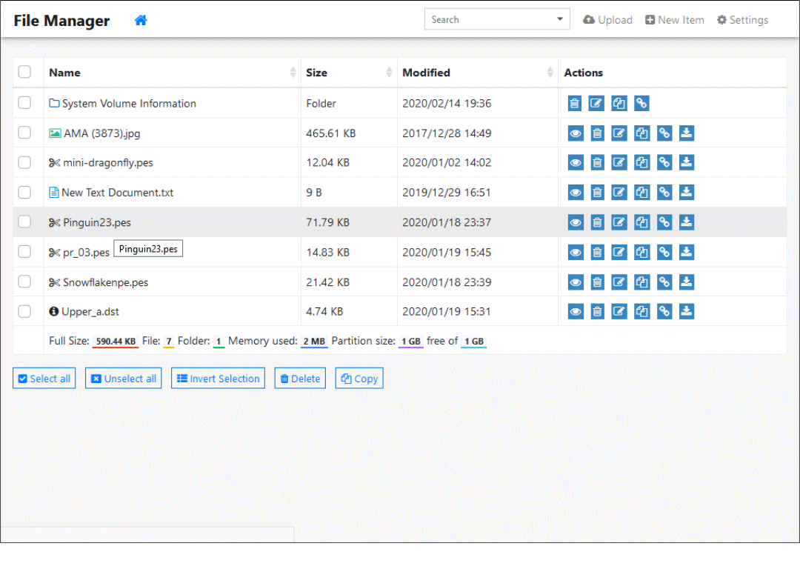

# PiZero-WU Tiny File Manager


[](https://pizero-wu-tinyfilemanager.github.io/demo/)
[](https://github.com/OneOfTheInfiniteMonkeys/pizero-wu-tinyfilemanager/wiki)
[](https://github.com/OneOfTheInfiniteMonkeys/pizero-wu-tinyfilemanager/releases)
 [](https://github.com/OneOfTheInfiniteMonkeys/pizero-wu-tinyfilemanager/blob/master/LICENSE) 

> Based on TinyFileManager by prasathmani, **PiZero-WU TinyFileManager** is simple web based file manager that is a small, fast, multi-language ready web application for storing, uploading, editing and managing files and folders online via web browser. The Application runs on PHP 5.5+.

>The Tiny File Manager PiZero-WU fork includes settings, extensions and code to permit viewing of special file types rendered by an additional support routine pyembroidery and configuration specific fetaures for PiZero-WU.

## Demo
[Demo](https://pizero-wu-tinyfilemanager.github.io/demo/)

 Login Details : admin/admin@123 | user/12345


## Documentation
Tinyfilemanager is highly documented on the [wiki pages](https://github.com/oneoftheinfinitemonkeys/pizero-wu-tinyfilemanager/wiki).


[](screenshot.gif)

## Requirements

- PHP 5.5.0 or higher.
- pyemroidery
- Fileinfo, iconv, zip, tar and mbstring extensions are strongly recommended.

## How to install
Installation is intended to be managed by PiZero-Wu installer.

For manual install:

a) Download the ZIP containing the latest version from master branch.

b) Unzip the files into a folder in your webspace

c) Check:
```
     $root_path = $_SERVER['DOCUMENT_ROOT'].'/tinyfilemanager/usb';
     set root url for links in file manager.Relative to $http_host. Variants: '', 'path/to/subfolder'
     $root_url = '/tinyfilemanager/usb';
```
Note '/tinyfilemanager/usb' is a **link** to the folder containing files to be managed with TinyFileManager. The link and files will need the appropriate access privalidges. It is typically the web user account not the TinyFileManager user names that need access to the files.

d) Create the temporary folder:
```
   Typically in the /var/www/html/tinyfilemanager folder to be used by the pyembroidery rendering software
   e.g. 
   cd /var/www/html/tinyfilemanager
   sudo mkdir tmp
```

To install the pyembroidery viewer use the following commands for Python version 3 and a raspberry pi:
```
a) sudo cd /home/pi/
b) sudo pip3 install pyembroidery
```

### Passwords

In test versions the authentication default is set to false. i.e. no passwords are required.

New passwords are set by using https://tinyfilemanager.github.io/docs/pwd.html to generate a hash. The hash is stored in the arrray "auth_users" which also defines the names. The defaults are:

Default username/password: **admin/admin@123** and **user/12345**.

To add or change the user names and passwords, the array $auth_users must be edited.

:warning: Warning: Please set your own username and password in `$auth_users` before use. password is encrypted with <code>password_hash()</code>. to generate new password hash [here](https://tinyfilemanager.github.io/docs/pwd.html)

To enable/disable authentication set `$use_auth` to true or false.


### :loudspeaker: Features 

- :cd: Open Source, light and extremely simple
- :iphone: Mobile friendly view for touch devices
- :information_source: Basic features likes Create, Delete, Modify, View, Quick Preview, Download, Copy and Move files 
- :arrow_double_up: Ajax Upload, Ability to drag & drop, upload from URL, multiple files upload with file extensions filter 
- :file_folder: Ability to create folders and files
- :gift: Ability to compress, extract files (`zip`, `tar`)
- :sunglasses: Support user permissions - based on session and each user root folder mapping
- :floppy_disk: Copy direct file URL
- :pencil2: Cloud9 IDE - Syntax highlighting for over `150+` languages, Over `35+` themes with your favorite programming style
- :page_facing_up: Google/Microsoft doc viewer helps you preview `PDF/DOC/XLS/PPT/etc`. 25 MB can be previewed with the Google Drive viewer
- :zap: Backup files and IP blacklist and whitelist
- :mag_right: Search -  Search and filter files using `datatable js`
- :file_folder: Exclude folders and files from listing
- :globe_with_meridians: Multi-language(20+) support and for translations `translation.json` is file required
- :bangbang: lots more...


### <a name=license></a>License, Credit  

- Available under the [GNU license](https://github.com/oneoftheinfinitemonkeys/pizero-wu-tinyfilemanager/blob/master/LICENSE)
- Original concept and development by github.com/alexantr/filemanager
- CDN Used - _jQuery, Bootstrap, Font Awesome, Highlight js, ace js, DropZone js, ekko-lightbox js, and DataTable js_
- To report a bug, please file an [issue](https://github.com/oneoftheinfinitemonkeys/pizero-wu-tinyfilemanager/issues)
- [Contributors](https://github.com/prasathmani/tinyfilemanager/wiki/Authors-and-Contributors)

### Attribution
[](https://www.paypal.me/prasathmani) - Donations to the author of the upstream master.

Donations to this fork author - None
